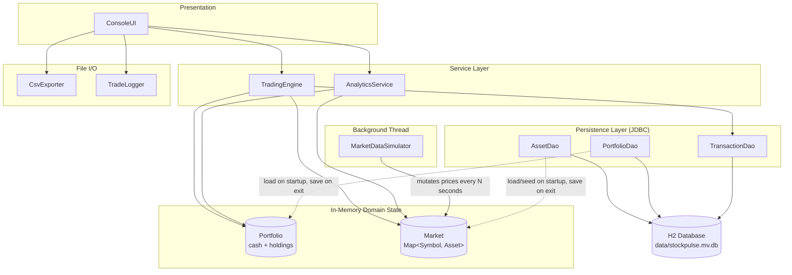

# System Architecture

StockPulse is a layered console application. The console/service layers operate on **in-memory** portfolio and market state; the DAO/JDBC layer is only touched on startup (load), on each trade (append a transaction), and on shutdown (save a snapshot) — the frequent, per-second price updates from the simulator thread never hit the database.

**Why the database is on the edges, not the hot path:** the simulator can tick every few seconds indefinitely; persisting every single price change would make the database the bottleneck and serialize what is otherwise a lock-free price update (see `Asset`'s use of `AtomicReference`). Instead, prices are loaded once at startup and snapshotted once at shutdown, while trades — which are comparatively rare and must never be lost — are written to the `transactions` table immediately as they happen.
