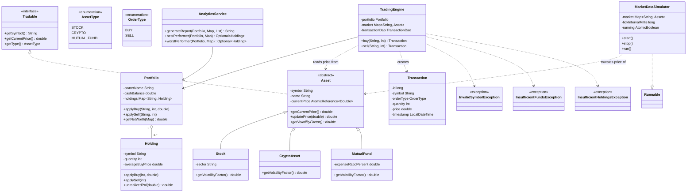

# Class Diagram

Focused on the domain model and the services that operate on it (DAO plumbing and exact getters are omitted for readability — see the Javadoc-style comments in source for those).

**Key design decisions reflected here:**
- `Asset` is abstract and delegates `getVolatilityFactor()` to each subtype, so the market simulator can treat every asset polymorphically while still giving crypto meaningfully different behaviour from a mutual fund.
- `TradingEngine` depends only on the narrow domain types (`Portfolio`, the `Asset` map, `TransactionDao`) and never touches the console or persistence details beyond logging a transaction — it can be unit-tested (see `TradingEngineTest`) without any UI.
- The three custom exceptions are checked exceptions, forcing every call site to explicitly handle a rejected order rather than letting it fail silently.
