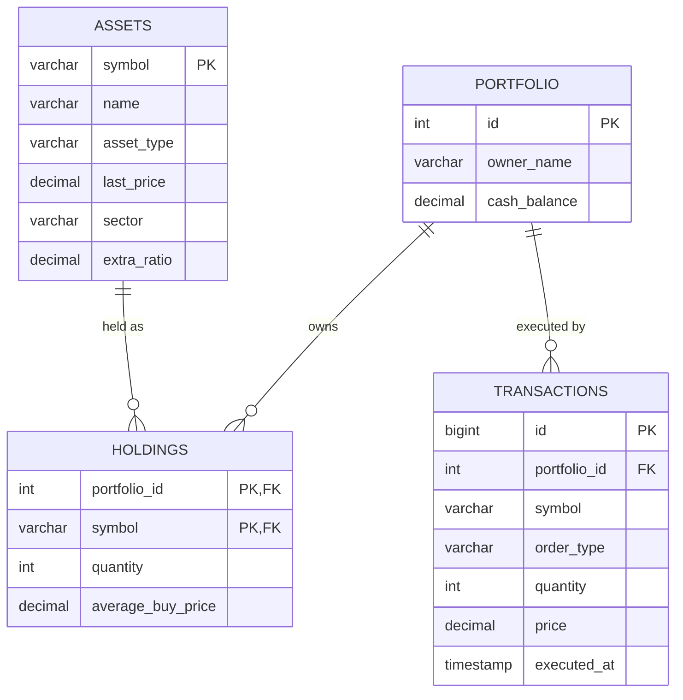

# ER Diagram

Matches `src/main/resources/schema.sql` exactly.

**Notes on the schema:**
- `HOLDINGS` uses a composite primary key `(portfolio_id, symbol)` since exactly one holding row can exist per asset per portfolio.
- `sector` and `extra_ratio` are nullable on `ASSETS` because they only apply to `Stock` and `MutualFund` respectively (a `CryptoAsset` row leaves both null) — a deliberate denormalization to keep a single-table catalogue instead of one table per asset type, which was not worth the extra join complexity for three asset types.
- `TRANSACTIONS` is append-only: rows are never updated or deleted, so it doubles as a full audit trail.
