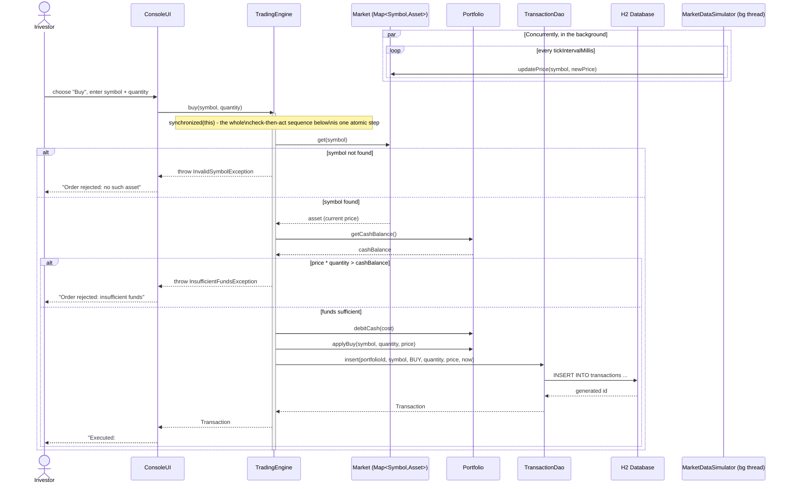

# Sequence Diagram — Placing a Buy Order

Shows the full path of a buy order, including the rejection branch, and highlights where the trading engine reads a price that the background simulator thread could change at any moment.

The `par` block at the top is the reason `Asset.currentPrice` is an `AtomicReference` rather than a plain field: the simulator thread and the trading engine genuinely execute at the same time, and the sequence diagram makes explicit that `TE ->> MKT: get(symbol)` can race with `MDS ->> MKT: updatePrice(...)` on any given order — the engine must always see one fully-formed price, never a torn or half-written one, which `AtomicReference` guarantees without a lock.
