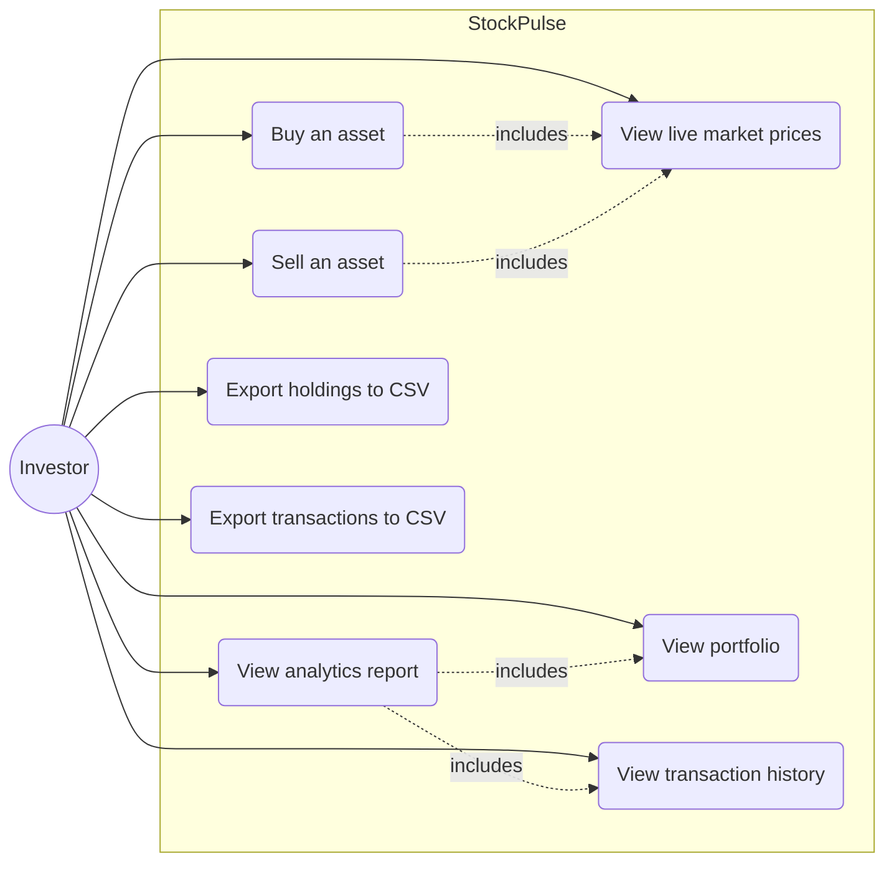

# Use Case Diagram

- **Buy an asset** and **Sell an asset** both include *View live market prices* because every order is priced against the current, live value of the asset at the moment it executes.
- **View analytics report** includes both *View portfolio* and *View transaction history* because the report is derived from the current holdings plus the full trade log.
