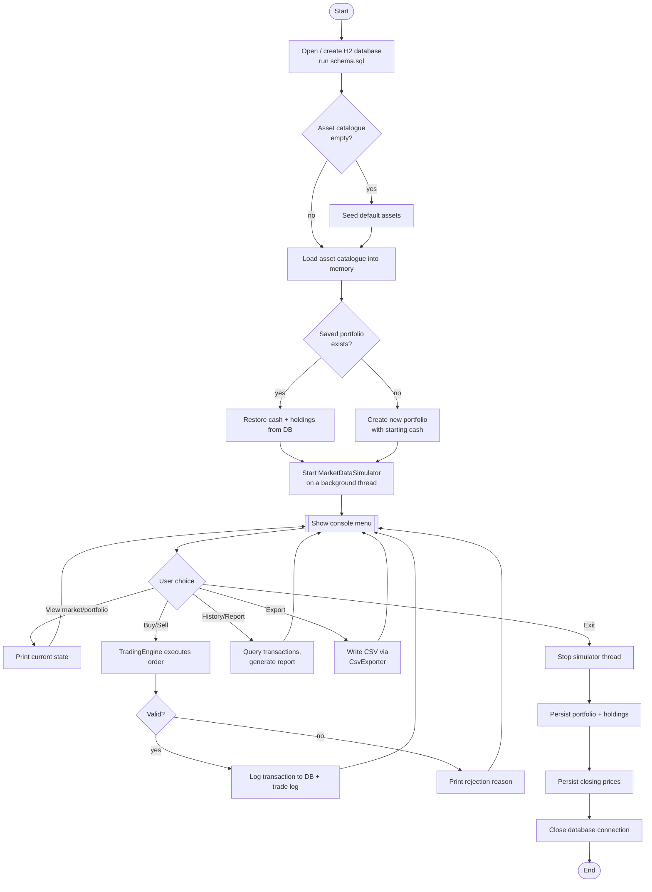

# Process Flow / Application Workflow

End-to-end lifecycle of a single run of the app, from launch to shutdown.

The background `MarketDataSimulator` thread runs concurrently with the entire menu loop from "Start MarketDataSimulator" until "Stop simulator thread" — it is not shown re-entering the diagram at every step because it operates independently of user input, which is the point of running it on its own thread.
